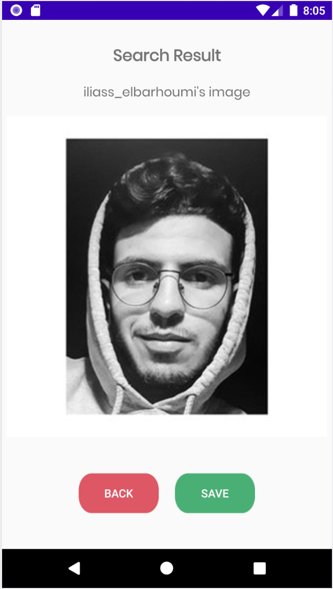

# InstagramImageViewer

## Idea of the App 
The task is to implement a small app that will get someone's profil picture from Instagram, just by his username or his url.

## Features
* As a User I should be able to see Instagram users profil pictures with big dimensions.
* As a User I should be able to store the image in my phone.

## How things works
I think that everyone who will hear about an app that get profils pictures from instagram,
He will think in the first second about Instagram API, but the special about this application,
is that it function without API, and this was the idea of the project.

When a User write someone's username, or he copied his url from Instagram App or the browser, 
the application make an HTTP request to the url entered, and get the query of the request, which is an HTML page.

In this HTML page, we can analyse it and find links to the profil picture of the person who we want to see his picture,
with differents dimensions (150x150, 320x320).

And the job is done, we display the image for the user to see it in comfortable dimensions.

The User has the possibility to store the image in his phone, and see it in his phone gallery any time he want.

## ScreenShots
This is how looks the main activity, where you can add the user's username or url

This is the result after that I entered my Instagram account's username

## Used Technology / Language
Android / Java

## Used Libraries
The libraries used for the execution of this application:
* Jsoup : data analysis and HTML data extraction library for Java
* Picasso : image loading/processing library to display the picture.

